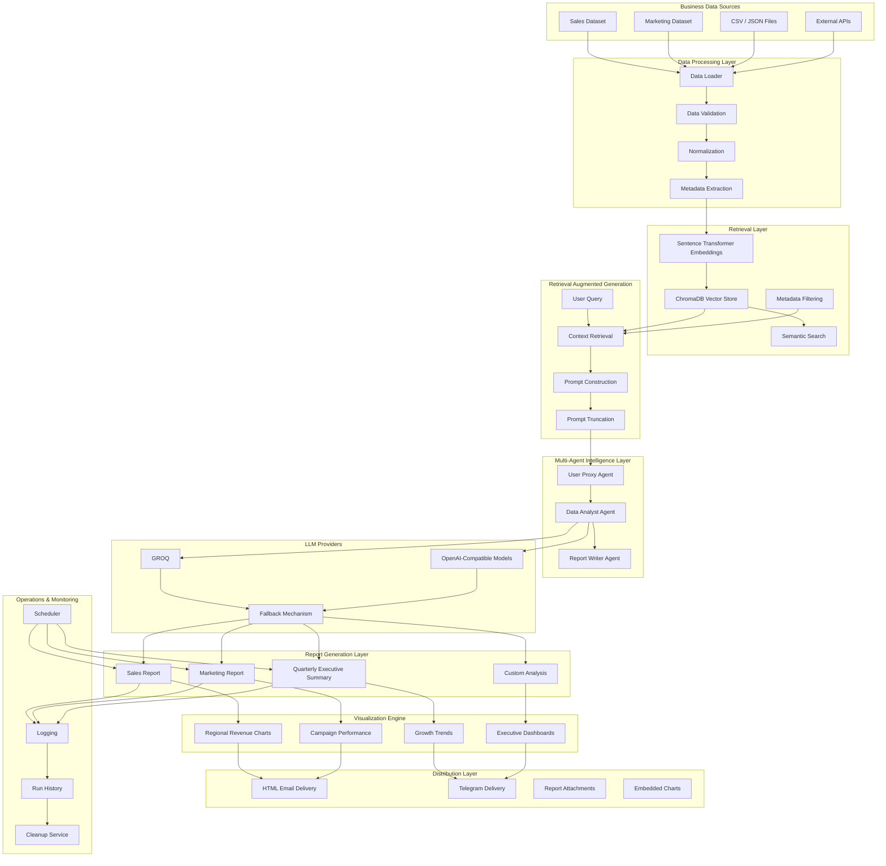
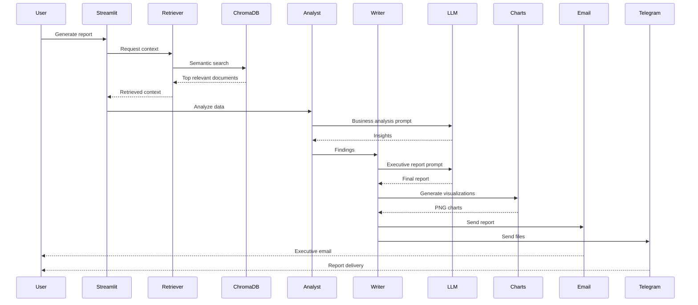

# AI Sales & Marketing Report Generator

<p align="center">
  
  
  
  
  
</p>

<p align="center">
  <b>Enterprise-Grade Multi-Agent RAG Reporting Platform</b>
</p>

<p align="center">
  Generate executive-level sales and marketing intelligence reports automatically using Retrieval-Augmented Generation (RAG), multi-agent orchestration, ChromaDB, publication-quality charts, and automated Email + Telegram delivery.
</p>

---

## Overview

This project is a complete AI-powered business intelligence reporting system designed to automate the full reporting lifecycle.

Instead of manually analyzing datasets, creating charts, writing summaries, exporting reports, and sending them to stakeholders, this platform performs the workflow automatically.

It combines:

- Retrieval-Augmented Generation (RAG) for evidence-based analysis
- multi-agent orchestration for modular reasoning
- ChromaDB for persistent vector search and metadata filtering
- matplotlib for automated chart generation
- HTML email delivery with inline charts and attachments
- Telegram delivery for lightweight distribution
- Streamlit UI for manual generation and review
- scheduler automation for recurring execution

The result is a practical reporting engine that turns business data into polished executive output with a strong emphasis on reliability, traceability, and modular design.

---

## Why This Project Stands Out

- **Business-first AI** rather than a generic chatbot
- **Modular architecture** with clean separation of retrieval, reasoning, visualization, and delivery
- **Fallback-friendly design** using AutoGen when available and GROQ-compatible generation when needed
- **Operational features** such as logging, retries, cleanup, scheduling, and run history
- **Multi-channel output** so the same report can be viewed in the app, emailed, or sent to Telegram

---

## Core Capabilities

### Analysis and Reasoning
- Sales performance analysis
- Marketing campaign analysis
- Quarterly summary reporting
- Product analysis
- Regional analysis
- Custom query analysis

### Retrieval and Data Handling
- Persistent vector store with ChromaDB
- Metadata-aware retrieval
- Domain-specific collections and filters
- Safe prompt truncation for large context windows
- Retrieval formatting designed for downstream LLM use

### Visualization
- Sales by region
- Quarterly performance
- Product performance
- Marketing ROI
- Channel performance
- Top products
- Regional comparison
- Quarterly growth

### Delivery and Automation
- HTML email with embedded charts
- Telegram file delivery
- Daily scheduled execution
- Immediate test execution via CLI
- Streamlit-driven manual generation

---

## System Architecture



---

## End-to-End Execution Flow



---

## Project Structure

```text
.
├── agent.py
├── app.py
├── config.py
├── email_sender.py
├── rag_retrieval.py
├── report_generator.py
├── scheduler.py
├── telegram_sender.py
├── vector_db.py
├── visualizations.py
├── data/
├── charts/
├── reports/
├── logs/
├── screenshots/
└── README.md
```

---

## Technology Stack

- **Language:** Python 3.8+
- **UI:** Streamlit
- **Vector DB:** ChromaDB
- **LLM Orchestration:** AutoGen + GROQ-compatible fallback
- **Charts:** matplotlib, NumPy
- **Delivery:** SMTP (Gmail), Telegram via Telethon
- **Scheduling:** schedule, asyncio
- **Persistence:** local files, logs, run history JSON

---

## Setup

### 1) Clone the repository

```bash
git clone <repo-url>
cd <repo-name>
```

### 2) Create and activate a virtual environment

```bash
python -m venv .venv
```

```bash
# macOS / Linux
source .venv/bin/activate

# Windows PowerShell
.venv\Scripts\Activate.ps1
```

### 3) Install dependencies

```bash
pip install -r requirements.txt
```

### 4) Configure environment variables

Create a `.env` file in the project root:

```env
# LLM / RAG
GROQ_API_KEY=
GROQ_API_URL=https://api.groq.com/openai/v1/chat/completions
GROQ_MODEL=llama-3.3-70b-versatile
OPENAI_TEMPERATURE=0.4
OPENAI_MAX_TOKENS=2000
OPENAI_RETRY_COUNT=3
OPENAI_RETRY_BACKOFF=2.0

# Vector store
CHROMA_DB_PATH=./chroma_db
COLLECTION_NAME=sales_marketing
RAG_DEFAULT_N_RESULTS=5
RAG_MAX_CONTENT_CHARS=2000
RAG_CONTEXT_MAX_ITEMS=5

# Optional collection overrides
VECTOR_DB_COLLECTION=
VECTOR_DB_SALES_COLLECTION=
VECTOR_DB_MARKETING_COLLECTION=
VECTOR_DB_COMBINED_COLLECTION=
VECTOR_DB_PRODUCT_COLLECTION=
VECTOR_DB_REGIONAL_COLLECTION=
VECTOR_DB_CUSTOM_COLLECTION=

# Email delivery
GMAIL_USER=
GMAIL_APP_PASSWORD=
RECIPIENT_EMAIL=

# Telegram delivery
TELEGRAM_API_ID=
TELEGRAM_API_HASH=
TELEGRAM_PHONE=
TELEGRAM_SESSION_NAME=report_generator_session_v2
TELEGRAM_MAX_RETRIES=3

# Scheduler
SCHEDULE_TIME=09:00
TIMEZONE=Asia/Kolkata
```

---

## Running the Project

### Streamlit App

```bash
streamlit run app.py
```

### Generate Charts Only

```bash
python -c "from visualizations import generate_all_charts; print(generate_all_charts())"
```

### Run the Full Pipeline Immediately

```bash
python scheduler.py now
```

### Start the Scheduler

```bash
python scheduler.py
```

### Test Telegram Delivery

```bash
python telegram_sender.py --test
```

---

## Streamlit UI Features

The Streamlit app allows you to:

- choose a report type
- provide optional filters such as region, quarter, channel, or product
- generate charts automatically
- preview output inside the UI
- download the generated report
- send the report by email
- send the report by Telegram

---

## Report Types

### Sales Performance
Analyzes sales trends by region and quarter.

### Marketing Campaign
Analyzes campaign performance by channel and quarter.

### Quarterly Summary
Produces a combined executive summary for the selected quarter.

### Product Analysis
Reviews product-level performance and related insights.

### Regional Analysis
Focuses on performance across a specific region.

### Custom Query
Accepts a free-form business question and generates a tailored analysis.

---

## Data and Retrieval Layer

`rag_retrieval.py` and `vector_db.py` provide the retrieval backbone of the system.

### Key behaviors
- retrieval queries can be enriched with an analysis focus
- ChromaDB collections are created or loaded automatically
- sales and marketing records are indexed with metadata
- results are normalized into prompt-ready context strings
- outputs are truncated safely to keep prompts manageable

### Why this matters
This design makes the system more explainable and more useful than a plain text generator. The report is not invented from scratch; it is grounded in stored business data.

---

## Visualization Layer

`visualizations.py` generates charts from the underlying `data/` files.

### Supported inputs
- `data/sales_data.json`
- `data/marketing_data.json`

### Generated charts
- `sales_by_region.png`
- `quarterly_performance.png`
- `product_performance.png`
- `marketing_roi.png`
- `channel_performance.png`
- `top_products.png`
- `regional_comparison.png`
- `quarterly_growth.png`

The charts are saved into the `charts/` directory and can be embedded into reports, emails, or Telegram deliveries.

---

## Delivery Layer

### HTML Email
The email sender can:

- attach report files
- embed chart images inline
- generate a readable plain-text fallback
- retry sending on failure

### Telegram
The Telegram sender can:

- authenticate using Telethon
- send a formatted header message
- send charts as files
- send reports as files
- send a footer confirmation message
- support test mode from the CLI

---

## Scheduler

The scheduler provides automation for daily execution.

### It does the following
- generates sales, marketing, and quarterly reports
- generates all charts
- sends the results by email
- sends the results by Telegram
- saves run metadata to `logs/run_history.json`
- cleans up older report/chart files

### Run modes
- `python scheduler.py` → starts the scheduled loop
- `python scheduler.py now` → runs once immediately

---

## Example Usage

### Generate a sales report from code

```python
from report_generator import generate_sales_performance_report

report = generate_sales_performance_report(region="North America", quarter="Q2 2024")
print(report)
```

### Generate a custom analysis

```python
from report_generator import generate_custom_analysis_report

report = generate_custom_analysis_report(
    "Why did sales drop in the North region last quarter?"
)
print(report)
```

### Save a report manually

```python
from report_generator import save_report_to_file

path = save_report_to_file("Sample report text", filename="reports/sample_report.txt")
print(path)
```

---

## Screenshots

Add your screenshots here to show the app and outputs in action.

```html
<p align="center">
  
</p>

<p align="center">
  
</p>
```

You can also include:

- Streamlit dashboard preview
- sample chart images
- email preview
- Telegram preview

---

## Operational Notes

- AutoGen is preferred when available.
- GROQ is used as a fallback if AutoGen is unavailable.
- Prompt and context truncation are used to avoid oversized inputs.
- Logging is enabled across the pipeline for debugging and auditability.
- File cleanup helps prevent long-term storage bloat.

---

## Troubleshooting

### No charts generated
Check that the `data/` directory contains valid JSON files with the expected schema.

### Email delivery failed
Verify Gmail credentials, app password, and recipient email in `.env`.

### Telegram delivery failed
Verify `TELEGRAM_API_ID`, `TELEGRAM_API_HASH`, and `TELEGRAM_PHONE`.

### Retrieval returns empty context
Confirm that ChromaDB has been initialized and that records were indexed successfully.

### GROQ fallback fails
Ensure `GROQ_API_KEY` and `GROQ_API_URL` are set correctly.

---

## Security Best Practices

- Never commit `.env` files.
- Keep API keys in a secrets manager.
- Rotate credentials regularly.
- Avoid indexing unnecessary sensitive data.
- Limit access to email and Telegram credentials.

---

## Roadmap

Potential next steps for the project:

- role-based delivery lists
- richer audit logs
- hybrid search improvements
- PDF export support
- dashboard history for past reports
- smarter fact-checking against raw source data

---

## Contributing

Contributions are welcome.

1. Fork the repository
2. Create a feature branch
3. Make your changes
4. Test locally
5. Submit a pull request with a clear description

---

## License

MIT License. See `LICENSE` for details.

---

## Final Note

This project is designed to be more than a demo. It is a practical template for building intelligent reporting systems that combine retrieval, reasoning, visualization, and delivery into one cohesive workflow.
